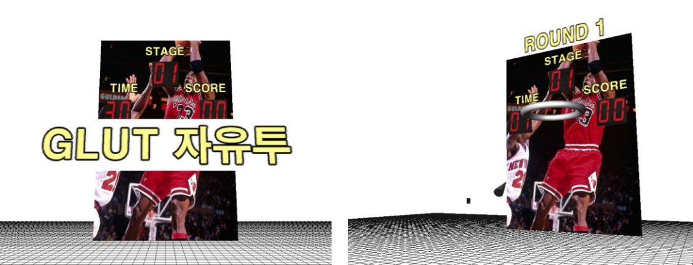
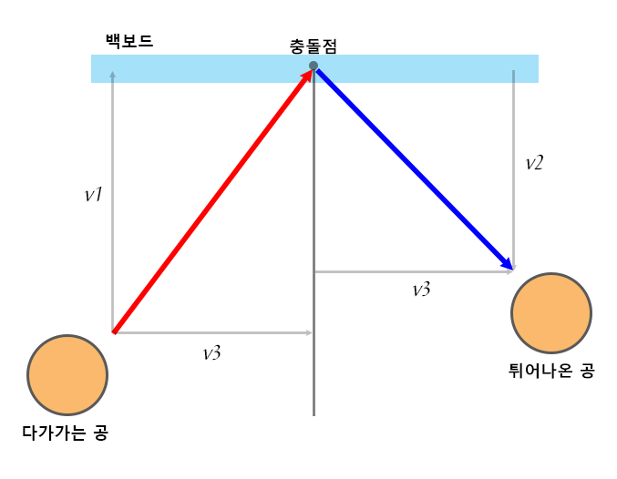
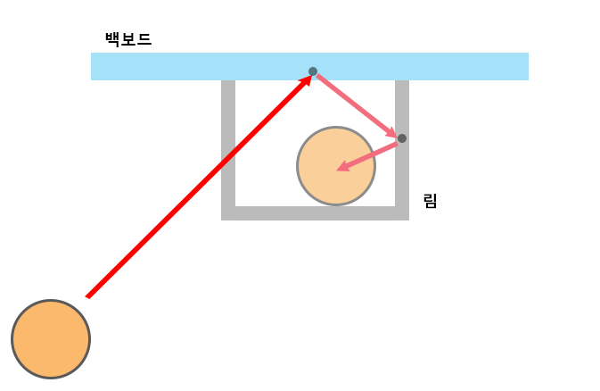

## 프로젝트 개요

- 아케이드 게임장에서 볼 수 있는 농구 게임을 재현한 프로젝트다.
- 공의 투척, 중력, 충돌의 물리적 계산을 직접 구현하였다.
- 마우스로 공의 방향을 조절하며, 스페이스바를 길게 누를 수록 공을 세게 투척한다.

## 공의 움직임 구현

공의 좌표와 속도를 저장하는 vector3 타입의 변수를 2개 선언했다. 다음으로 일정시간마다 호출되는 Timer 함수 만들고 아래 과정을 반복 수행했다.
- 공의 속도 += 중력가속도 * Timer의 호출간격
- 공의 좌표 += 공의 속도 * Timer의 호출간격

공의 속도와 좌표를 계산한 후 렌더링 함수를 호출하면, 중력을 받으며 날아가는 공의 모습을 재현할 수 있었다.

## 공과 림, 백보드의 충돌 구현  

- 공의 좌표가 림 및 백보드의 내부로 들어왔을 때, 공의 운동 벡터를 법선과 평행, 수직한 벡터인 v1, v3로 각각 나눈다 (그림에서는 y축 방향의 벡터를 제외하였다).
- v1에 대해 크기는 e(반발계수, 0 < e <= 1)배 이고 방향은 반대인 벡터 v2를 구한다.
- v2와 v3를 더해 튀어나온 공의 운동 벡터를 구한다.

- 림은 위 그림처 백보드와 동일한 평면 3개를 사용해 구현하였다.
- 림의 내부 범위 안에서 공이 y축 아래 방향으로 이동할 경우 '골'로 판정했다.

## 프로젝트 실행 영상
- 1단계에서는 림이 제자리에 있지만 2단계부터는 좌우로 움직이도록 구현해 난이도를 높였다.